<div align="center">



<br/>

[](https://github.com/a14770)

[](https://github.com/a14770?tab=followers)


</div>

<br/>

<div align="center">
  
</div>

<br/>

## ⚡ `STACK.tecnologica`

<div align="center">


</div>

<br/>

## 📡 `TELEMETRIA.github`

<div align="center">


</div>

<br/>

## 🧪 `PROJETOS.destaque`

<div align="center">

<a href="https://github.com/a14770/oficina-reconhecimento-facial-node.js"></a>
<a href="https://github.com/a14770/java-oop"></a>
<a href="https://github.com/a14770/CRUD"></a>
<a href="https://github.com/a14770/TREMU-NA-OFICINA"></a>

</div>

<details>
<summary><b>📂 Ver todos os repositórios</b></summary>
<br/>

| Projeto | O que faz | Tech |
|---|---|---|
| [oficina-reconhecimento-facial](https://github.com/a14770/oficina-reconhecimento-facial-node.js) | Reconhecimento facial no navegador | `HTML` `JavaScript` `Node.js` |
| [java-oop](https://github.com/a14770/java-oop) | Programação Orientada a Objetos | `Java` |
| [CRUD](https://github.com/a14770/CRUD) | Create, Read, Update, Delete | `Java` |
| [javaTurmas](https://github.com/a14770/javaTurmas) | Revisões e exercícios | `Java` |
| [IPO](https://github.com/a14770/IPO) | Interação Pessoa-Computador | `JavaScript` |
| [TREMU-NA-OFICINA](https://github.com/a14770/TREMU-NA-OFICINA) | Projeto de oficina | `JavaScript` |

</details>

<br/>

## 🐍 `CONTRIBUICOES.snake`

<div align="center">

<picture>
  <source media="(prefers-color-scheme: dark)" srcset="https://raw.githubusercontent.com/a14770/a14770/output/github-snake-dark.svg" />
  <source media="(prefers-color-scheme: light)" srcset="https://raw.githubusercontent.com/a14770/a14770/output/github-snake.svg" />
  
</picture>

</div>

<br/>

## 🏆 `CONQUISTAS`

<div align="center">


<br/><br/>


</div>

<br/>

## 🎯 `ROADMAP.2026`

```diff
+ [x] Dominar os fundamentos de Java e POO
+ [x] Construir CRUDs e projetos de turma
+ [x] Explorar reconhecimento facial com Node.js
! [~] Aprender Spring Boot e APIs REST
! [~] Publicar um projeto full stack completo
- [ ] Estudar Docker e deploy na nuvem
- [ ] Contribuir para projetos open source
- [ ] Conseguir o primeiro estágio em tecnologia
```

<br/>

## 📬 `CONTACTO`

<div align="center">

<!-- Troca SEU-USUARIO / SEU-EMAIL pelos teus dados reais, ou apaga o botão -->
[](https://www.linkedin.com/in/SEU-USUARIO)
[](mailto:SEU-EMAIL@exemplo.com)
[](https://instagram.com/SEU-USUARIO)

<br/>


</div>
